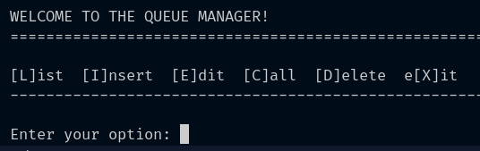

# queue_manager

Project to study Object Orientation in Dart. A queue manager for office.

When we call the program, the following menu is presented:

- [L]ist:
  To list patients already registered in order of severity, age and arrival.
  The order of patients in the queue is reanalyzed each time a new patient is registered and when a patient already registered is edited.

- [I]nsert:
  To register a new patient and insert him in the service queue.
  The program will prompt you to input the patient's name, gender, age and a severity level.
  The severity levels as options are: 1 for low, 2 for medium and 3 for high severity of the patient's situation.

- [E]dit:
  To edit the data of an already registered patient. The program lists registered patients with their respective index. The user chooses the patient to be edited by the index.
  The user chooses which data to edit and then enters the new value.

- [C]all:
  To call the first patient in the service queue.
  The program shows the patient and their data and deletes the record from the queue.

- [D]elete:
  To delete a registered patient. The program lists registered patients with their respective indexes. The user chooses the patient to be deleted by the index.
  The user must confirm their choice.

- e[X]it:
  To terminate the program.
